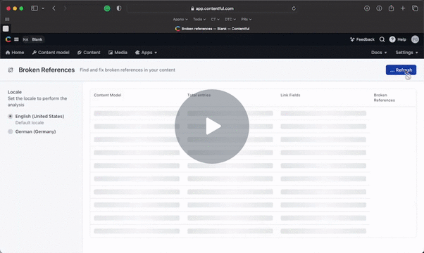
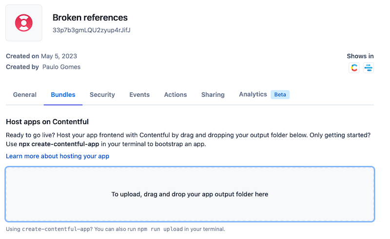
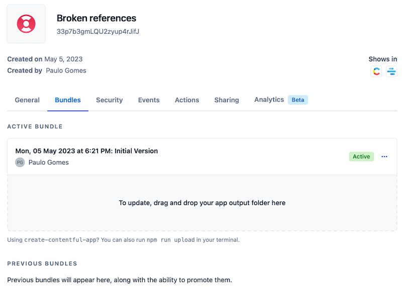
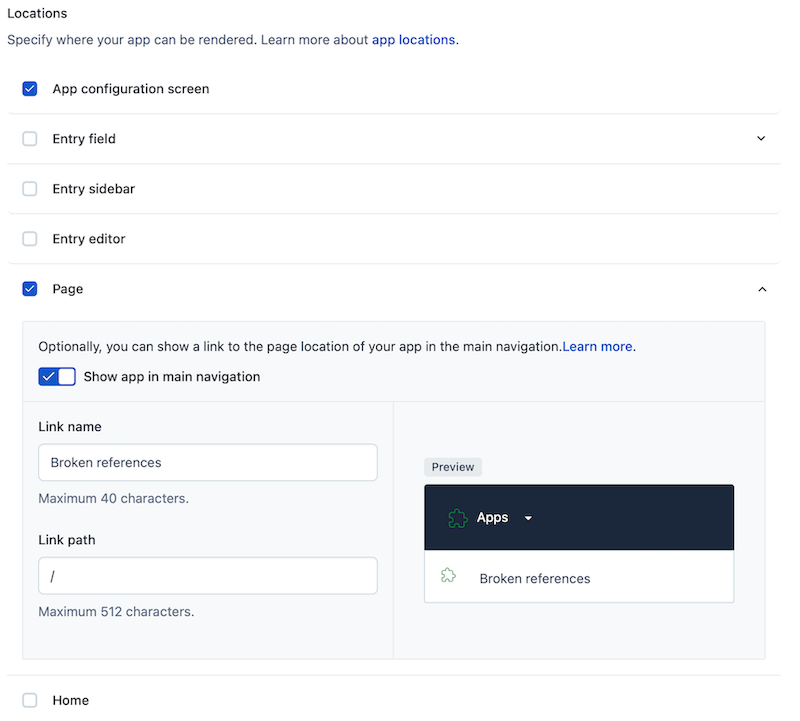
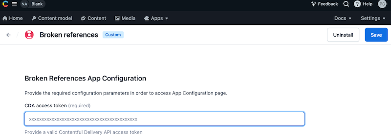
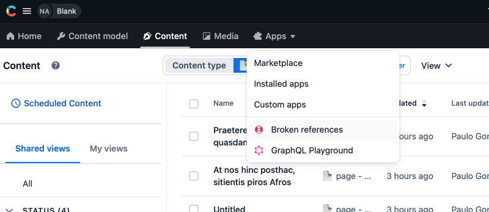
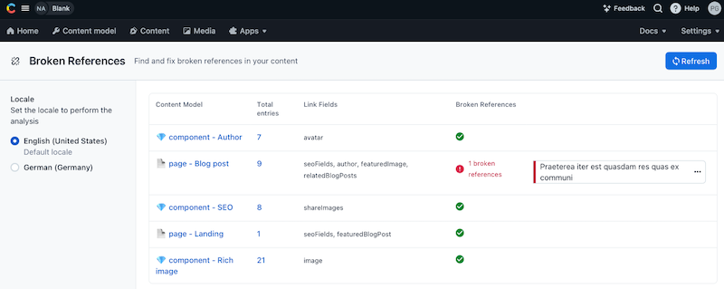

# Contentful Broken References App

The Contentful Broken References App is a simple [Contentful App](https://www.contentful.com/developers/docs/extensibility/app-framework/) providing an interface to bulk identify broken references in the contents.

A broken reference occurs when the linked entry is deleted or unpublished, making it inaccessible to the reference field.
Typically and depending on how your application is built a broken reference can results in an error, causing issues, such as missing content or broken relationships. To ensure data integrity and avoid these issues, this App will help to identify and resolve broken references in your Contentful entries.

## 🛠 Setup

Install the App using by doing the below steps:

1. Create a new Contentful custom App and define the Application Name (e.g. Broken References)

2. Download this repo and drag the dist folder into the Bundles upload zone:

Give a name to the bundle

You can find more details about hosting an [Contentful app her](https://www.contentful.com/developers/docs/extensibility/app-framework/hosting-an-app/)

3. Set the App configuration screen and Page location

4. Save, and Install the App in your space, on the space configuration screen fill the Contentful Delivery Access token.

5. The App should be available in the Apps menu:

6. Open the App and it will automatically analyze and display if any, a list of broken references:

Clicking in the broken reference items will open the affected entry and you'll be able to fix it.

## 🥷 Development

In the project directory, you can run:

#### `yarn start`

Creates or updates your app definition in Contentful, and runs the app in development mode.
Open your app to view it in the browser.

The page will reload if you make edits.
You will also see any lint errors in the console.

#### `yarn build`

Builds the app for production to the `dist` folder.
It correctly bundles React in production mode and optimizes the build for the best performance.

The build is minified and the filenames include the hashes.
Your app is ready to be deployed!

#### `yarn upload`

Uploads the `dist` folder to Contentful and creates a bundle that is automatically activated.
The command guides you through the deployment process and asks for all required arguments.
Read [here](https://www.contentful.com/developers/docs/extensibility/app-framework/create-contentful-app/#deploy-with-contentful) for more information about the deployment process.

#### `yarn upload-ci`

Similar to `yarn upload` it will upload your app to contentful and activate it. The only difference is
that with this command all required arguments are read from the environment variables, for example when you add
the upload command to your CI pipeline.

For this command to work, the following environment variables must be set:

- `CONTENTFUL_ORG_ID` - The ID of your organization
- `CONTENTFUL_APP_DEF_ID` - The ID of the app to which to add the bundle
- `CONTENTFUL_ACCESS_TOKEN` - A personal [access token](https://www.contentful.com/developers/docs/references/content-management-api/#/reference/personal-access-tokens)

## 💡Learn more

This project was bootstrapped with [Create Contentful App](https://github.com/contentful/create-contentful-app).

## Copyright and license

Copyright 2023 pauloamgomes under the MIT license.
